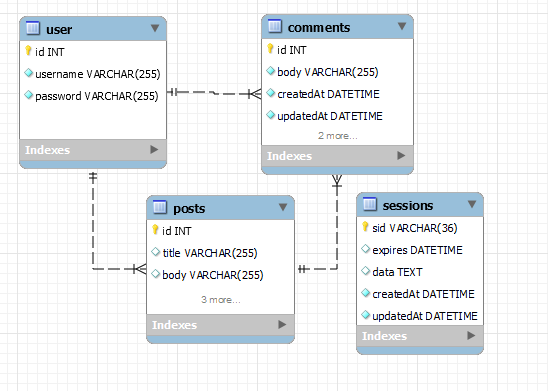

<h1 align = "center">Model-View-Controller (MVC): Tech Blog </h1>

---

1. [Description](#desc)
2. [Web Address](#webaddress)
3. [Usage Tips](#usage)
4. [Features](#feature)
5. [Install Command](#command)
6. [Credits](#credits)
7. [Licenses](#licenses)
8. [Questions and Contributing](#qnacontri)

---

## Description

A CMS-style blog site where developers can publish their blog posts and comment on other developer's post. This is a full stack web application that was build using [bcrypt](https://www.npmjs.com/package/bcrypt) , [sequelize](https://www.npmjs.com/package/sequelize) , [sequelize-sessions](https://www.npmjs.com/package/express-sequelize-session) , [express-handlebars](https://www.npmjs.com/package/express-handlebars)

---

## Web Address

- Deployed on Heroku 
[Tech-Blog](https://hr-tech-blog.herokuapp.com/)

---

## Usage Tips

If you want to run local follow below steps:-

This app is running under MySQL as a local host, you can modify the .env file with your own username and password to start the application.

Once your .evn file has been configured:

- run mysql terminal at project source folder and run schema.sql (source ./db/schema.sql)
- npm install
- npm start
- use http://localhost:3001/ 

---

## App Features

### Database Design

### Screenshots

## Install Command

To install dependency enter the command "npm i" or npm install" in your terminal

### Dependency

- [mysql2](https://www.npmjs.com/package/mysql2)
- [express](https://www.npmjs.com/package/colors)
- [dotenv](https://www.npmjs.com/package/asciiart-logo)

### Launch the app

Run following command in your terminal `node server.js`

---

## Credits

[hrsautomation20](https://github.com/hrsautomation20)

---

## Licenses

  

---

## Questions and Contributing

### For Questions please reach out to Repo Owner :-

- GitHub - https://github.com/hrsautomation20
- Email - [H Rola](mailto:hrsautomation20@gmail.com?subject=[GitHub]%20Source%20Han%20Sans)

### For Contributing

Feel free to download or colone the repo and make local changes
